# Quan hệ dữ liệu

```mermaid
erDiagram
 USERS ||--o| AUTH_IDENTITIES : google
 USERS ||--o| INTERNAL_CREDENTIALS : internal
 USERS ||--o{ SESSIONS : sessions
 USERS ||--o{ USER_PERMISSIONS : grants
 USERS ||--o{ AFFILIATE_LINKS : creates
 CASHBACK_POLICIES ||--o{ AFFILIATE_LINKS : snapshots
 CASHBACK_POLICIES ||--o{ CASHBACK_TIERS : ranges
 CASHBACK_POLICIES ||--o{ ORDERS : version
 AFFILIATE_CHANNELS ||--o{ AFFILIATE_LINKS : channel
 AFFILIATE_LINKS ||--o{ ORDERS : attributes
 USERS ||--o{ ORDERS : owns
 ORDERS ||--o{ ORDER_EVENTS : history
 ORDERS ||--o{ ORDER_ITEMS : items
 USERS ||--o{ WALLET_ACCOUNTS : balances
 WALLET_ACCOUNTS ||--o{ WALLET_ENTRIES : postings
 WALLET_TRANSACTIONS ||--o{ WALLET_ENTRIES : balances
 USERS ||--o{ WITHDRAWALS : requests
 USERS ||--|| COIN_ACCOUNTS : coins
 USERS ||--o{ COIN_TRANSACTIONS : coin_history
 USERS ||--o{ CHECKINS : days
 USERS ||--o{ GIFT_REDEMPTIONS : redeems
 GIFT_CATALOG ||--o{ GIFT_REDEMPTIONS : gift
 USERS ||--o{ DEALS : posts
 DEALS ||--o{ DEAL_LIKES : likes
 NOTIFICATIONS ||--o{ NOTIFICATION_RECEIPTS : read
 IMPORT_BATCHES ||--o{ IMPORT_ROWS : preview
 USERS ||--o{ AUDIT_LOGS : actor
 USERS ||--o{ PRIVATE_FILES : uploads
 USERS ||--o{ IDEMPOTENCY_RECORDS : retries
```

`wallet_accounts.kind`: available, held, debt hoặc system. Balance của tài khoản khách không âm; system cho phép đối ứng âm. Khoản thiếu được trả trước khi credit thêm vào available. Một transaction có nhiều entry và tổng entry bằng 0.

`orders.status` là trạng thái duyệt nội bộ; `source_status` là trạng thái nguồn sàn. Chỉ cộng tiền khi nguồn approved và admin duyệt. Link/policy giữ phiên bản tại thời điểm tạo, thay chính sách không tính lại đơn cũ.

`cashback_tiers` chứa đúng ba hạng cho mỗi phiên bản `tiered`: bronze/platinum/diamond, ngưỡng đơn duyệt và min/max basis point. `affiliate_links` chụp `tier_code`, `min_share_bps`, `max_share_bps`; `orders.share_bps` lưu lần random đã commit. Một basis point bằng 0,01%; tiền hoàn tính bằng phép nhân/chia số nguyên rồi làm tròn xuống VND. Dữ liệu legacy giữ hạng null, khoảng cố định và tỷ lệ cũ. Khóa advisory theo channel/publisher/external_id/line_id bảo vệ tạo đơn giữa CSV và nhập tay.

`users.bank_details` chứa JSON `{bank, account, holder}` mã hóa AES-GCM, nullable khi chưa cấu hình. `holder` là họ tên đầy đủ trên ngân hàng, độc lập với `users.name`; `account` là chuỗi để giữ số 0 đầu. Chỉ chủ hồ sơ đọc/sửa qua `/me`. `withdrawals.bank_details` mã hóa snapshot của từng yêu cầu và không cập nhật theo hồ sơ sau đó.
